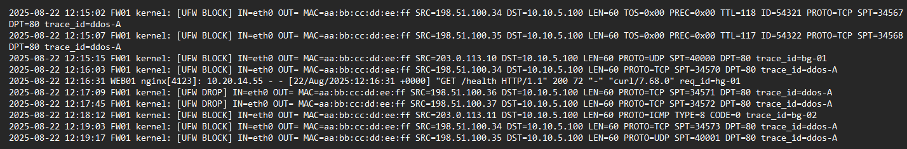
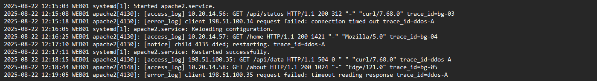
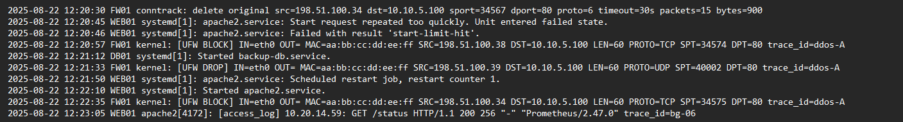

# Logs
Firewall / Network perimeter logs.



Application / Web server logs



System & Service logs




# Traffico DDoS Iniziale
```
└── 12:15:02 FW01 UFW BLOCK ... tentativo di TCP flood da 198.51.100.34 ... 10.10.5.100:80
└── 12:15:07 FW01 UFW BLOCK ... TCP flood attempt da 198.51.100.35 ... 10.10.5.100:80
└── 12:15:15 FW01 UFW BLOCK ... UDP flood da 203.0.113.10 ... 10.10.5.100:80
└── 12:16:03 FW01 UFW BLOCK ... TCP flood (repeat 198.51.100.34)
└── 12:17:09 FW01 UFW DROP ... TCP flood 198.51.100.36
└── 12:17:45 FW01 UFW DROP ... TCP flood 198.51.100.37
└── 12:18:12 FW01 UFW BLOCK ... ICMP echo flood da 203.0.113.11
└── 12:19:03 FW01 UFW BLOCK ... TCP flood 198.51.100.34 (di nuovo)
└── 12:19:17 FW01 UFW BLOCK ... UDP flood 198.51.100.35
└── 12:20:57 FW01 UFW BLOCK ... TCP flood 198.51.100.38
└── 12:21:33 FW01 UFW DROP ... UDP flood 198.51.100.39
└── 12:22:35 FW01 UFW BLOCK ... TCP flood 198.51.100.34 (continuing..)
```
Gli attacchi cominciano in modo evidente alle 12:15:02, quando il firewall principale (FW01) registra il primo log di blocco UFW. In quel momento viene segnalato un pacchetto TCP sospetto proveniente dall’indirizzo IP 198.51.100.34 e diretto al server interno 10.10.5.100 sulla porta 80, cioè la porta standard per il traffico HTTP. Questo evento rappresenta l’inizio di un attacco flood TCP, tipico di un tentativo di Denial of Service.
Pochi secondi dopo, alle 12:15:07, un altro indirizzo IP, 198.51.100.35, tenta la stessa cosa... un ulteriore flood TCP sempre contro la porta 80 dello stesso server. Quasi in contemporanea, alle 12:15:15, si aggiunge un nuovo tipo di traffico: questa volta l’attacco non è TCP ma UDP, proveniente dall’IP 203.0.113.10. Anche questo viene diretto alla porta 80. La varietà dei protocolli dimostra che l’attaccante non si limita a un solo metodo, ma cerca di sovraccaricare il server utilizzando più tecniche contemporaneamente.
La situazione peggiora progressivamente. Alle 12:16:03 lo stesso IP 198.51.100.34 torna a colpire con un ulteriore flood TCP, segno che gli attacchi sono continui e ripetuti, non singoli tentativi. Nei minuti seguenti altri indirizzi (198.51.100.36 e 198.51.100.37) compaiono nei log con ulteriori richieste TCP malevole. Questo indica la presenza di più macchine o bot che partecipano a un attacco coordinato.
Alle 12:18:12 viene rilevato anche traffico ICMP echo (ping flood) dall’IP 203.0.113.11. Qui l’attaccante prova a usare i pacchetti ICMP per intasare il server con richieste di ping continue. Infine, tra le 12:19 e le 12:22, si notano altri pacchetti UDP e TCP provenienti dagli stessi IP, in particolare 198.51.100.34 che ricompare più volte.


# Impatto sul Servizio WEB01 e Service Failure
```
└── 12:15:18 apache2 error ... timeout dal client 198.51.100.34
└── 12:17:10 apache2 notice ... child process terminated, riavvio in corso
└── 12:18:15 apache2 access_log ... 198.51.100.35 GET /api/data ... 504 Gateway Timeout
└── 12:19:05 apache2 error_log ... timeout lettura risposta per 198.51.100.35
```

Anche se il firewall filtra parte del traffico, alcuni pacchetti raggiungono comunque il web server. Apache comincia a mostrare instabilità .alle 12:15:18 segnala un timeout su richiesta da 198.51.100.34. Poco dopo, alle 12:17:10, un processo figlio di Apache si chiude e viene riavviato. Ancora più tardi, alle 12:18:15, una richiesta dall’IP 198.51.100.35 per l’API restituisce un 504 Gateway Timeout. Apache quindi non cade del tutto, ma mostra rallentamenti e instabilità tipiche di un DDoS.
```
└── 12:20:30 FW01 conntrack ... deleting stale TCP session from attacker
└── 12:20:45 systemd ... apache2 start-limit reached ... servizio in failed state
└── 12:20:46 systemd ... apache2 failed with 'start-limit-hit'
└── 12:21:50 systemd ... restart job programmato per apache2
└── 12:22:10 systemd ... apache2 riavviato con successo
└── 12:23:05 apache2 ... traffico normale (Prometheus GET /status) mostra service recovery
```

Alle 12:20:45 systemd segnala che apache2 ha superato il limite di riavvii e va in stato “failed”. Subito dopo, però, viene programmato un nuovo restart e alle 12:22:10 Apache riparte. Infine, alle 12:23:05 si vedono richieste normali da Prometheus, segno che il servizio si è ripreso, anche se rimane vulnerabile.

