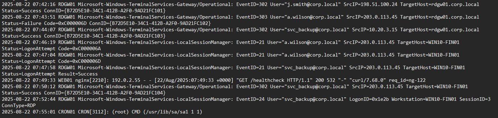
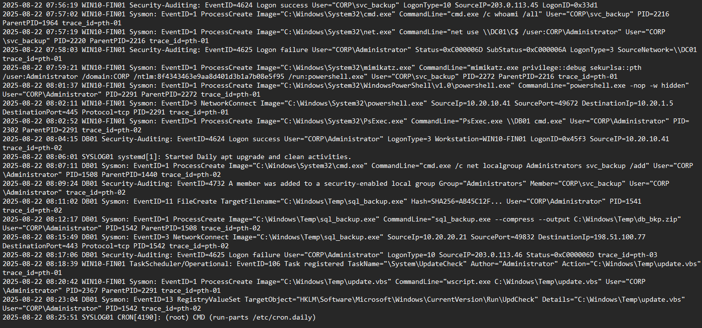

# Logs
Windows Event logs



Endpoint logs



---
#

Un ticket dal SIEM che segnalava un tentativo di lateral movement, legato all’esecuzione di mimikatz.exe su WIN10-FIN01 alle 07:59:21. 

` 2025-08-22 07:59:21 WIN10-FIN01 Sysmon: EventID=1 ProcessCreate Image="C:\Windows\System32\mimikatz.exe" CommandLine="mimikatz.exe privilege::debug sekurlsa::pth /user:Administrator /domain:CORP /ntlm:8f4343463e9aa8d401d3b1a7b08e5f95 /run:powershell.exe" User="CORP\svc_backup" PID=2272 ParentPID=2216 trace_id=pth-01`

Questo tipo di evento è molto sospetto perché mimikatz viene usato per rubare credenziali o fare attacchi Pass-the-Hash. Però, in quel log non era chiaro da quale IP provenisse l’attività, quindi ho dovuto ricostruire a ritroso la catena dei processi.
Partendo da mimikatz (PID 2272, utente CORP\svc_backup), ho visto che il processo era child proccess di cmd.exe (PID 2216), che poco prima aveva lanciato net.exe per tentare di accedere al file share di DC01 come Administrator. Prima ancora, lo stesso cmd.exe aveva eseguito un semplice comando `whoami /all ` per verificare i privilegi.
Infine, andando ancora più indietro, nel log di sicurezza ho trovato  (EventID 4624) alle 07:56:19 che mostra il logon RDP riuscito di svc_backup, proveniente dall’indirizzo `203.0.113.45`. A quel punto ho potuto confermare sia l’account usato che l’IP sorgente dell’attaccante.
Quindi il metodo è stato... partire dall’alert (mimikatz), risalire attraverso i PID e i parent process, fino al log di accesso che indicava chiaramente la provenienza
Ora, visto che ho identificato sia l’utente compromesso che l’IP sorgente, posso ricostruire la catena degli eventi partendo dall’entry point.

#

```
Accesso Iniziale
 └── 07:43:51 RDGW01 EventID=303 ... Tentativo RDP fallito (a.wilson) da 203.0.113.45
 └── 07:47:58 RDGW01 EventID=21 ... RDP riuscito (svc_backup) da 203.0.113.45
     └── 07:50:12 RDGW01 EventID=302 ... Connessione RDP confermata (svc_backup)
```

L’attacco inizia con i tentativi di accesso via RDP Gateway (RDGW01). 
07:43:51 vediamo il primo segnale... l’utente a.wilson@corp.local prova a collegarsi dall’IP 203.0.113.45, ma l’evento (ID 303) mostra un fallimento di autenticazione. Poco dopo, tra le 07:46 e le 07:47, lo stesso utente riprova ma ottiene ancora errori di logon. Questo ci indica che l’attaccante stava testando credenziali diverse o tentando un brute force limitato.
Alle 07:47:58 la situazione cambia... appare un accesso riuscito, questa volta con l’account svc_backup@corp.local proveniente dallo stesso indirizzo IP esterno (203.0.113.45). L’evento (ID 21 su LocalSessionManager) segnala il logon positivo sulla macchina target WIN10-FIN01. Subito dopo, alle 07:50:12, un altro evento (ID 302) conferma la connessione RDP stabilita e valida sempre con le stesse credenziali.
Infine, alle 07:52:44, un evento ID 24 ci mostra che la sessione interattiva RDP di svc_backup è stata completamente stabilita con SessionID=3, indicando che l’attaccante ha ottenuto un accesso persistente e operativo.

#

```

Esecuzione su WIN10-FIN01
 └── 07:56:19 Security 4624 ... Logon successo (svc_backup) from 203.0.113.45
     └── 07:57:02 Sysmon 1 ... cmd.exe ("whoami /all")
     └── 07:57:19 Sysmon 1 ... net.exe (tentativo accesso admin share \\DC01\C$)
         └── 07:58:03 Security 4625 ... Logon fallito (Administrator@DC01)
```

Dopo l’accesso iniziale su WIN10-FIN01, i log mostrano un evento 4624 che conferma il logon remoto riuscito dell’account CORP\svc_backup dall’IP esterno 203.0.113.45 con LogonType=10 (RemoteInteractive). Questo evento segna l’inizio dell’attività diretta dell’attaccante sulla macchina.
Subito dopo, i log Sysmon (EventID 1) registrano l’esecuzione di cmd.exe con il comando "whoami /all". Il PID assegnato è 2216, con ParentPID=1964, e l’utente rimane svc_backup. Questo è un chiaro segnale di ricognizione interna. l’attaccante verifica i privilegi dell’account compromesso.
Pochi secondi dopo, alle 07:57:19, sempre da Sysmon, vediamo l’esecuzione di net.exe con il comando "net use \\DC01\C$ /user:CORP\Administrator", PID=2220. Qui l’attaccante prova a montare la condivisione amministrativa del Domain Controller (DC01) usando l’account Administrator. Tuttavia, il log successivo alle 07:58:03 (EventID 4625) mostra che il tentativo di logon è fallito con codice di errore 0xC000006D.

#

```
Accesso alle Credenziali
 └── 07:59:21 Sysmon 1 ... mimikatz.exe (Pass-the-Hash tentativo come Administrator)
     └── Avvia powershell.exe sotto CORP\Administrator
```

07:59:21 su WIN10-FIN01, i log Sysmon mostrano l’esecuzione di mimikatz.exe (EventID 1), un tool molto noto per il furto di credenziali. Il comando eseguito è lungo e chiaro...
`mimikatz.exe privilege::debug sekurlsa::pth /user:Administrator /domain:CORP /ntlm:8f4343463e9aa8d401d3b1a7b08e5f95 /run:powershell.exe.`
Questo significa che l’attaccante, usando l’account già compromesso CORP\svc_backup, ha provato un attacco di tipo Pass-the-Hash (PtH) contro l’account Administrator del dominio. Il PID assegnato a mimikatz è 2272, con ParentPID=2216 (che corrisponde al cmd.exe visto poco prima). L’uso del parametro `/run:powershell.exe` indica che, se il PtH riesce, verrà aperta direttamente una sessione PowerShell con i privilegi dell’amministratore.

#

```
Lateral Movement
 └── 08:02:11 Sysmon 3 ... PowerShell connessione SMB (10.20.10.41 ... 10.20.1.5:445)
 └── 08:02:52 Sysmon 1 ... PsExec.exe lanciato (target = DB01)
     └── 08:04:15 DB01 Security 4624 ... Logon successo (Administrator da WIN10-FIN01)
```

Dopo aver ottenuto una shell PowerShell come CORP\Administrator, l’attaccante passa subito alla fase di Lateral Movement. Alle 08:02:11 i log Sysmon mostrano che powershell.exe (PID=2291) stabilisce una connessione SMB verso 10.20.1.5 sulla porta 445, partendo da WIN10-FIN01 (IP sorgente 10.20.10.41). Questa connessione indica un tentativo di muoversi lateralmente verso altri server sfruttando le credenziali di dominio rubate.
poi viene creato un nuovo processo... PsExec.exe (Sysmon EventID 1). Cioé PsExec.exe \\DB01 cmd.exe, con utente CORP\Administrator. PsExec è uno strumento legittimo usato dagli amministratori per eseguire comandi su host remoti, ma in questo caso viene abusato dall’attaccante per ottenere accesso al server DB01.
La prova del movimento riuscito arriva alle 08:04:15, quando i log di DB01 registrano un evento Security 4624, logon di successo con account CORP\Administrator, proveniente proprio da WIN10-FIN01.
Con questo, l’attaccante ha completato il lateral movement--->partendo da una macchina client compromessa (WIN10-FIN01), è riuscito ad arrivare al server critico DB01 usando credenziali amministrative di dominio.

#

```
Privilege Escalation su DB01
 └── 08:07:11 Sysmon 1 ... cmd.exe aggiunge svc_backup agli Administrators
 └── 08:09:24 Security 4732 ... Cambio gruppo (svc_backup ... Administrators)
```

Dopo l’accesso al server DB01 con l’account CORP\Administrator, l’attaccante procede subito con la Privilege Escalation locale per consolidare il controllo. Alle 08:07:11, i log Sysmon mostrano la creazione di un processo cmd.exe (PID=1508) che esegue...
`net localgroup Administrators svc_backup /add`
Questo comando aggiunge l’utente di servizio svc_backup al gruppo locale Administrators. Poco dopo, alle 08:09:24, i log di sicurezza di Windows (EventID 4732) confermano ufficialmente l’operazione...il gruppo Administrators è stato modificato e svc_backup è ora membro con privilegi elevati.
Questo passaggio è cruciale, perché l’attaccante non dipende più solo dalle credenziali rubate di Administrator, ma ha anche elevato un account di servizio “normale” (svc_backup) per garantirsi accesso privilegiato. È una tipica tecnica di Privilege Escalation + Persistence ibrida, dato che l’account rimane disponibile anche dopo eventuali reset della sessione principale.


#

```
Esfiltrazione
 └── 08:11:02 Sysmon 11 ... File creato sql_backup.exe
 └── 08:12:17 Sysmon 1 ... sql_backup.exe comprime database files
 └── 08:15:49 Sysmon 3 ... sql_backup.exe connessione IP esterno (198.51.100.77:443)
```
Subito dopo aver ottenuto privilegi su DB01, l’attaccante passa alla fase di exfiltration. Alle 08:11:02, i log Sysmon (EventID 11) mostrano la creazione di un file sospetto sql_backup.exe nella cartella C:\Windows\Temp. Il file è eseguito poco dopo (PID=1542), con...
`sql_backup.exe --compress --output C:\Windows\Temp\db_bkp.zip`
Questo indica chiaramente che l’attaccante ha preparato un archivio dei database presenti sul server, probabilmente mascherando l’attività come un normale “backup”.
Alle 08:12:17, il file compresso db_bkp.zip è generato, e poco dopo, alle 08:15:49, i log Sysmon (EventID 3) mostrano la connessione verso un IP esterno 198.51.100.77 sulla porta 443 (HTTPS). Questo dettaglio è fondamentale: l’uso della porta HTTPS rende il traffico simile a normale comunicazione web, aumentando la probabilità di bypassare controlli superficiali.
Quindi, in questa fase, l’attaccante ha non solo compresso i dati critici ma li ha anche trasferiti all’esterno, riuscendo a esfiltrare database sensibili attraverso un canale cifrato. Questo rappresenta un chiaro furto di dati aziendali.


#

```
Persistenza
 └── Su WIN10-FIN01:
     └── 08:18:39 TaskScheduler 106 ... Task registrato "UpdateCheck" (update.vbs)
     └── 08:20:42 Sysmon 1 ... update.vbs eseguito
 └── Su DB01:
     └── 08:23:04 Sysmon 13 ... Registry Run key aggiunto (update.vbs persistence)
```


Dopo l’esfiltrazione, l’attaccante pensa a come restare dentro la rete senza dover ripetere l’intrusione. Ecco che scatta la fase di persistence.
Sul sistema WIN10-FIN01, alle 08:18:39, i log TaskScheduler mostrano la creazione di un task chiamato UpdateCheck, registrato dall’utente Administrator. Subito dopo, alle 08:20:42, Sysmon registra l’esecuzione dello script update.vbs, un chiaro tentativo di mantenere un foothold automatico che si avvia senza intervento umano.
Parallelamente, anche su DB01 l’attaccante lascia tracce: alle 08:23:04 viene inserita una chiave di registro sotto` HKLM\Software\Microsoft\Windows\CurrentVersion\Run` con valore `update.vbs`. Questo significa che ad ogni riavvio della macchina, lo script malevolo viene eseguito automaticamente, garantendo così accesso continuo.
La combinazione di scheduled task e registry run key rappresenta una doppia garanzia di persistenza, rendendo difficile rimuovere l’attaccante anche dopo un semplice riavvio o update di sistema. È una tecnica comune nei movimenti laterali avanzati: unire task pianificati e chiavi di registro Run per assicurarsi che il malware sopravviva e si riattivi regolarmente.

